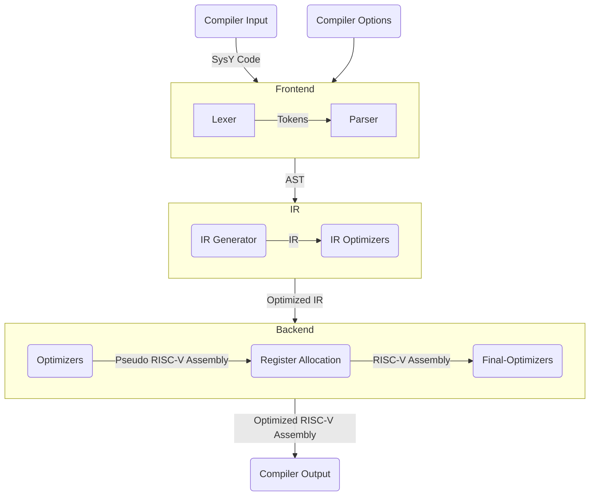

# SysY Compiler

## Getting Started

### Development

```shell
sudo apt install flex cmake clang

# Install bison 3.8
wget http://ftp.gnu.org/gnu/bison/bison-3.8.tar.gz
tar -zxvf bison-3.8.tar.gz
cd bison-3.8
./configure
make
sudo make install
sudo ln -s /usr/local/bin/bison /usr/bin/bison

# Generate parser and lexer
./scripts/yacc_gen.sh

# Build using cmake
...
```

### Tests

The machanism of the contest is compiling everything altogether. So we need to flatten the source code.

```shell
python3 tests/execute.py
```

This will generate the `syc` executable in the current directory.

### Debug

To cross debug, we need to install `gdb-multiarch`.

```shell
sudo apt install gdb-multiarch
```

Compile the assembly generated by syc:

```shell
riscv64-linux-gnu-gcc -march=rv64gc ./tests/test.s -L./sysy-runtime-lib -lsylib -o ./tests/test
```

Use QEMU to run the program. This will listen on port 1234.

```shell
qemu-riscv64 -L /usr/riscv64-linux-gnu -g 1234 ./tests/test < ./tests/test.in &
```

Use GDB to connect to QEMU. This will load the symbols in the executable.

```shell
gdb-multiarch ./tests/test
```

In GDB, connect to QEMU.

```shell
target remote :1234
```

Then just debug.

## Architecture



## Optimizations

- Frontend
  - Simple common subexpression elimination.
- IR
  - Mem2reg
  - Function return value optimization
    - If return value is not used, change function return type to void
  - Purity optimization
    - Common subexpression elimination for call
    - Remove unused call if the function is pure
  - Auto inlining
    - Inline non-recursive function
  - Simple global to local
    - Make global value local in main after inlining
  - Global value numbering
  - Unreachable code elimination
  - Straighten control flow
  - Algebraic simplification
  - Constant folding
  - Constant propagation
  - Strength reduction
  - Loop invariant code motion
  - Loop unrolling
    - Full unroll for loop with constant trip count
  - Simple loop induction variable
  - Peephole optimization
  - Dead code elimination
- Backend
  - Register allocation
    - Based on greedy allocator
    - Remove split stage and simplify spill stage
    - Loop-based spill weight calculation
  - Phi elimination (in cooperation with IR mem2reg)
  - Simple dead code elimination
  - Strength reduction
  - Peephole optimization
  - Redundant code elimination
  - Aggressive floating-point instruction fusion

## Todo List

- [x] Try to use temporary register for temporary immediate loading.
  - t0, t1, ft0, ft1, ft2 is used in spilling virtual registers.
  - t2 is used in codegen for temporary immediate loading, pseudo load/store and comparison.
- [x] Strength reduction
  - [x] IR: integer multiplication to shift.
  - [x] IR: integer division by 2 to shift.
  - [x] IR: integer division by 2^k to shift.
- [ ] Loop optimization
  - [x] Unrolling
  - [ ] Parallelization
  - [ ] Loop variable induction
    - [x] Basic for gep instruction
    - [ ] Non-zero initial value
    - [ ] More instructions
- [ ] loop interchange for `performance/01_mmx.sy`
- [ ] if condition simplification
  - [ ] if (a / c0 >= c1) -> if (a > c0 * c1 - 1)
